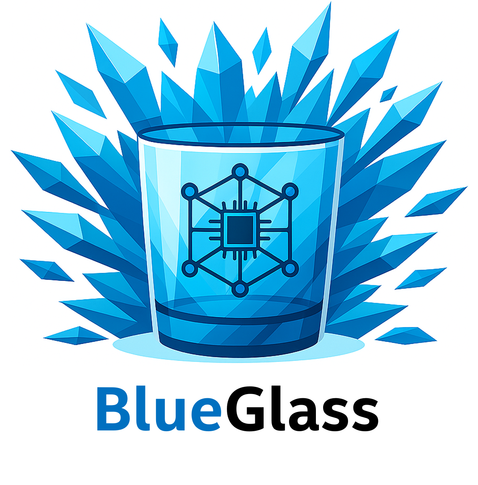
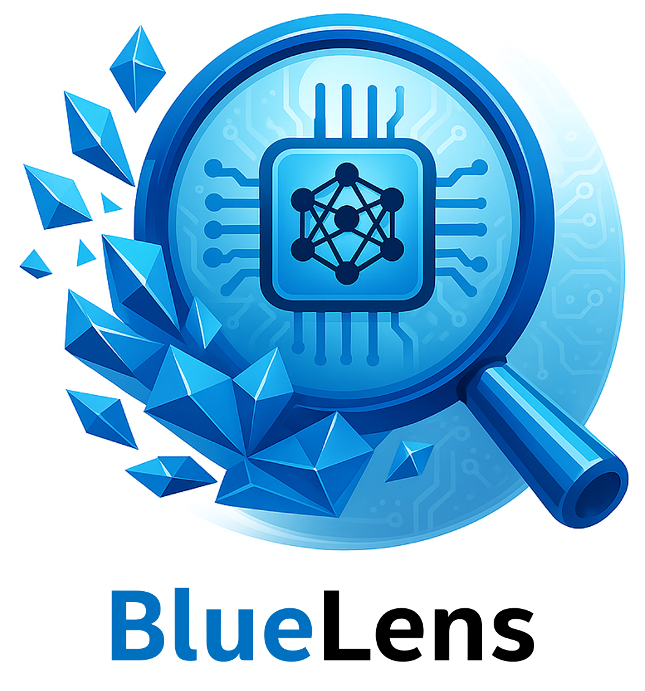

  

# 🔷 BlueGlass

**BlueGlass** is an open-source framework for interpretability and analysis of vision-language and vision-only models. It empowers researchers and practitioners to understand what deep models *see* and *focus on* by offering tools to extract, probe, and build ad hoc XAI models for internal representations.

The framework includes a custom infrastructure and lightweight modifications to third-party model libraries, enabling seamless feature extraction from the models. These extracted features are compiled into structured datasets called **BlueLens**, laying the foundation for advanced Explainable AI research and experimentation.

---

## ✨ Key Features

- **Benchmarking**  
  Seamless support for benchmarking different models with various datasets and evaluators.
  
-  **[BlueLens Dataset Extraction](https://huggingface.co/datasets/IntelLabs/BlueLens)**
   - Effortlessly generate feature datasets for training ad-hoc models by capturing model activations using a custom interceptor manager - **Feature Recorder**
     
       

       
       
 

- 🧪 **Ad-hoc Interpretability Models**  
  Leverage the BlueLens dataset to train models like:
  - Linear Probes  
  - Sparse Autoencoders (SAEs)  
  - Other direct interpretability techniques  
  All optimized for **large batch sizes** and efficient performance.

- 🧰 **Generate Custom BlueLens Dataset**  
  Use the built-in tools to generate your own **BlueLens** dataset from any model.
 
- 🔁 **Feature Patching & Re-Integration**  
  Ad-hoc models can be patched back into the base model using the **Feature Patcher**, enabling:  
  - Validation of interpretability methods  
  - Performance benchmarking of modified models

- 🚀 **Streamlined Runner**  
  A simplified, plug-and-play design built around modular runners and interfaces for training, validating, and evaluating ad-hoc models.

- ⚙️ **Scalable Training**  
  - Native support for **distributed training**  
  - Central control over **precision** (e.g., FP16, BF16)

- 🔍 **Interpretability & Analysis**  
  Built for both **vision-language** and **vision-only** models with a focus on **clarity**, **transparency**, and **scalability**.

---

## 📦 Coming Soon

- 🔍 Prebuilt probes for common models  
- 📚 Tutorials and example notebooks

---

## 🧪 Get Started

> Coming soon: Installation guide, usage examples, and API reference.

---

## 📖 Detailed Documentation
#### [🛠️ BLUEGLASS Project Pipeline Overview](docs/project_execution_overview.md)
#### [📊 Benchmarking Guide](docs/benchmarking.md)
#### [🧩 Feature Extraction](docs/02_feature_extraction.md)
#### [🔍 Interpreter Tools](docs/03_interp_tools.md)
#### [📂 Dataset Handling and Management](docs/05_data_preparation.md)
#### [▶️ Usage Guide](docs/usage_guide.md)

## 🤝 Contributing

We welcome contributions! Feel free to open issues or submit pull requests to help expand the BlueGlass ecosystem.

---

